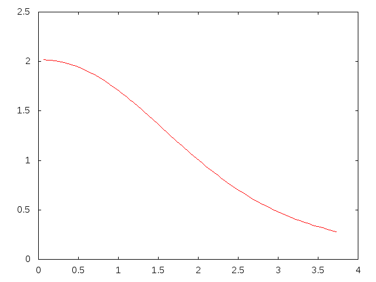

PHYS2200m2p
===========

Internal Structure
------------------

To show the structure of the a white dwarf where p(0) = 10, the following differential equations were used:

dm/dr = p(r)*r^2
dp/dr = -m(r)*p(r)/(g(p)*r^)

Where g(p) = (p^(2/3))/(3*sqrt(1 + p^(2/3)))

This was the result:

The radius is on the x-axis, and the density is on the y-axis. Notice that as the radius increases, the density decreases.

Radius Vs. Mass
---------------

To plot the Radius vs. Mass of the white dwarf, the radius and mass of white dwarfs with center densities varying between .1 and 1,000,000 were calculated and plotted. The following was the result:

The radius is on the x-axis, and the mass is on the y-axis. Notice that the mass decreases as the radius increases. 