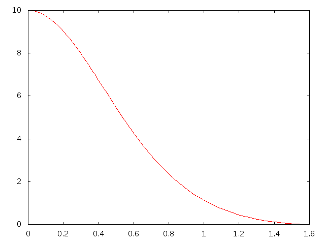

PHYS2200m2p
===========

Internal Structure
------------------

To show the structure of the a white dwarf where p(0) = 10, the following differential equations were used:

dm/dr = p(r)*r^2
dp/dr = -m(r)*p(r)/(g(p)*r^)

Where g(p) = (p^(2/3))/(3*sqrt(1 + p^(2/3)))

This was the result:
